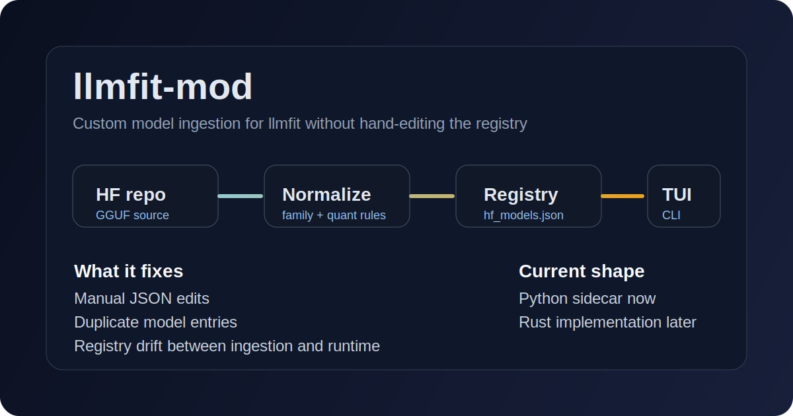

# llmfit-mod

`llmfit-mod` extends [`llmfit`](https://github.com/AlexsJones/llmfit).

`llmfit` already has the useful part: a CLI and TUI over a normalized model registry. This repo patches the missing path for custom models. It stages external Hugging Face GGUF repos, normalizes them into llmfit-style entries, and merges them into the registry that `llmfit` compiles into the binary.

Without this, custom model handling turns into manual JSON edits, inconsistent naming, and duplicate registry state.

System boundary:

```text
Hugging Face repo -> ingestion -> normalized registry -> runtime
```



This repo handles the normalization and registry part.

Past that point the same registry feeds search, routing, evaluation, and orchestration. If the registry is wrong, everything above it is wrong.

This should end up as Rust inside `llmfit`. Right now it is a Python sidecar because that was the fastest path to a working extension.

Course:

- AI Engineering 2026: https://www.udemy.com/course/ai-engineering-2026-chatgpt-rag-agentic-systems/?referralCode=0CD7DB8A1D87430DE6F6

## Files

```text
llmfit-mod/
├── assets/
│   ├── landing-wave.jpg
│   └── hero.svg
├── llmfit-model-adder.py
├── llmfit-integrate.sh
├── examples/
│   ├── sample-custom-models.json
│   ├── sample-hf-models-before.json
│   └── sample-hf-models-after.json
└── README.md
```

Use `llmfit-model-adder.py`. The `_v2` wrapper is not part of the public path.

## Behavior

- expands one Hugging Face repo into one or more quantized llmfit entries
- replaces stale entries for the same model family on repeated runs
- merges staged entries into `llmfit-core/data/hf_models.json`
- lets you rebuild and activate `llmfit` so the compiled binary sees the new models

## Repo Boundary

Included here:

- `llmfit-model-adder.py`
- `llmfit-integrate.sh`
- `examples/`
- `README.md`

Not included here:

- vendored `llmfit-source`
- upstream git history
- build outputs and caches
- internal PM/task artifacts

Bring your own `llmfit` checkout.

## Prerequisites

- Python 3
- a local `llmfit` checkout
- Rust toolchain for rebuilding `llmfit`
- permission to replace `/usr/local/bin/llmfit` if you want plain `llmfit` to use the rebuilt binary

Example checkout:

```bash
git clone https://github.com/AlexsJones/llmfit.git /path/to/llmfit-source
```

## Validated Flow

This flow was validated on `popos`.

```bash
cd /path/to/llmfit-mod

# 1. Add a model family to the local custom DB
python3 llmfit-model-adder.py add Ex0bit/MiniMax-M2.1-PRISM

# 2. Inspect staged custom entries
python3 llmfit-model-adder.py list

# 3. Merge into your llmfit checkout
./llmfit-integrate.sh /path/to/llmfit-source

# 4. Rebuild llmfit
source ~/.cargo/env
cd /path/to/llmfit-source
cargo build --release

# 5. Replace the active installed binary if you use `llmfit` by name
sudo cp target/release/llmfit /usr/local/bin/llmfit

# 6. Verify
llmfit search MiniMax-M2.1-PRISM

# Or run the rebuilt binary directly
./target/release/llmfit search MiniMax-M2.1-PRISM
```

`cargo build --release` updates `target/release/llmfit`.

It does not replace `/usr/local/bin/llmfit`.

If you run `llmfit` by name, you need:

```bash
sudo cp target/release/llmfit /usr/local/bin/llmfit
```

Expected active install path:

```bash
/usr/local/bin/llmfit
```

## Quick Start

```bash
python3 llmfit-model-adder.py add bartowski/Llama-3.1-8B-Instruct-GGUF
python3 llmfit-model-adder.py list
./llmfit-integrate.sh /path/to/llmfit-source

source ~/.cargo/env
cd /path/to/llmfit-source
cargo build --release
sudo cp target/release/llmfit /usr/local/bin/llmfit

llmfit search Llama-3.1-8B-Instruct
./target/release/llmfit search Llama-3.1-8B-Instruct
```

The merge target is `llmfit-core/data/hf_models.json`.

If `data/hf_models.json` also exists in the checkout, the script mirrors the merged output there.

## CLI

```bash
# Add all discovered quantizations
python3 llmfit-model-adder.py add <repo-id>

# Keep only specific quantizations in the custom database
python3 llmfit-model-adder.py add <repo-id> --quants Q4_K_M Q6_K

# Inspect the staged custom database
python3 llmfit-model-adder.py list [--db /path/to/custom_hf_models.json]

# Export normalized entries without mutating the local custom database
python3 llmfit-model-adder.py export <repo1> <repo2> --output models.json

# Merge a prepared JSON payload into the local custom database
python3 llmfit-model-adder.py merge --input models.json [--db /path/to/custom_hf_models.json]
```

Default custom database:

```text
~/.cache/llmfit/custom_hf_models.json
```

Override it with `--db` on the Python CLI or `LLMFIT_CUSTOM_DB` / `--db` on the integration script.

## TUI

If the model shows up in `./target/release/llmfit search ...` but not in plain `llmfit`, the installed binary is stale.

Check:

```bash
which llmfit
/path/to/llmfit-source/target/release/llmfit search <model-fragment>
```

Expected:

```bash
/usr/local/bin/llmfit
```

Fix:

```bash
sudo cp /path/to/llmfit-source/target/release/llmfit /usr/local/bin/llmfit
```

If you do not want to replace the system binary, run the rebuilt one directly:

```bash
/path/to/llmfit-source/target/release/llmfit
```

## Registry Checks

Check merged llmfit JSON:

```bash
python3 - <<'PY'
import json
data = json.load(open('/path/to/llmfit-source/llmfit-core/data/hf_models.json'))
for m in data:
    if 'minimax-m2.1-prism' in m['name'].lower():
        print(m['name'], '->', m.get('quantization'))
PY
```

Validated MiniMax entries:

- `Ex0bit/MiniMax-M2.1-PRISM-Q1_S`
- `Ex0bit/MiniMax-M2.1-PRISM-Q2_M`
- `Ex0bit/MiniMax-M2.1-PRISM-Q4_NL`

## Examples

The `examples/` directory contains:

- `sample-custom-models.json`
- `sample-hf-models-before.json`
- `sample-hf-models-after.json`

Use them to validate the merge path without hitting Hugging Face.
